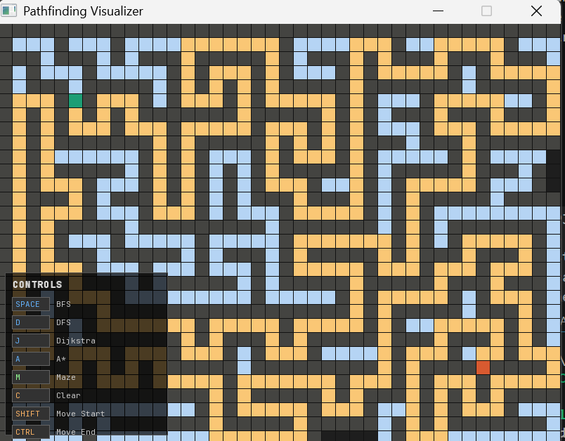

# 🗺️ Pathfinding Visualizer

A real-time, interactive pathfinding algorithm visualizer built from scratch in **C++ using SFML**.
Draw walls, generate mazes, and watch four different algorithms find their way through — step by step, cell by cell.



---

## 🎯 Project Goal

The goal of this project was to deeply understand graph traversal algorithms by building a visual tool that makes them *tangible*. Instead of just reading about BFS or A* in a textbook, you can watch them explore a grid in real time, compare how they behave differently, and see exactly why some algorithms are smarter than others.

This project was built as a learning exercise covering:
- Graph algorithms and data structures
- C++ architecture and object-oriented design
- Real-time rendering with SFML
- CMake build systems
- Event-driven programming

---

## ✨ Features

- 🖱️ **Interactive grid** — draw and erase walls by clicking and dragging
- 🟢 **Moveable start and end nodes** — drag them anywhere on the grid
- 🔍 **4 pathfinding algorithms** — each animated step by step
- 🌀 **Recursive maze generator** — generates a unique solvable maze every time
- 🧭 **On-screen controls legend** — no need to read docs to use it
- ⚡ **Time-based animation** — smooth, consistent speed regardless of frame rate

---

## 📸 Demo

> Generate a maze with `M`, then press `A` to watch A* navigate it.

<!-- Add your screenshot here -->

---

## 🧠 Algorithms

### 1. BFS — Breadth First Search (`SPACE`)
**Data structure:** Queue (FIFO)

BFS explores the grid layer by layer — all cells 1 step away first, then 2 steps, then 3, and so on. Think of it like ripples spreading outward in water from the start node.

Because it always explores the *closest* cells first, BFS **guarantees the shortest path** on an unweighted grid. The tradeoff is that it explores every reachable cell before finding the end — you'll see the entire grid flood blue before the path appears.

```
Start → explore all neighbors at distance 1
      → explore all neighbors at distance 2
      → ...until End is reached
```

**Best for:** Finding the guaranteed shortest path when all steps cost the same.

---

### 2. DFS — Depth First Search (`D`)
**Data structure:** Stack (LIFO)

DFS goes as deep as possible in one direction before backtracking. It dives down one corridor, hits a dead end, backtracks, tries another direction, and repeats.

DFS does **not** guarantee the shortest path — the path it finds can be long and winding. But it uses less memory than BFS and is useful for maze solving and cycle detection.

The key insight: **DFS and BFS are identical algorithms — only the data structure changes.** Queue → BFS. Stack → DFS. One line of code, completely different behavior.

```
Start → go as deep as possible in one direction
      → backtrack when stuck
      → try next direction
```

**Best for:** Exploring all possible paths, detecting cycles, generating mazes.

---

### 3. Dijkstra (`J`)
**Data structure:** Priority Queue (min-heap)

Dijkstra tracks the actual cumulative cost from the start to every visited cell, and always processes the *cheapest* cell next using a priority queue.

On our unweighted grid (every cell costs 1), Dijkstra behaves identically to BFS. Its real power shows on **weighted graphs** — imagine some cells being "mud" that costs 5 to enter vs normal ground costing 1. BFS would walk straight through the mud. Dijkstra would route around it if it's cheaper.

This is the algorithm behind **Google Maps** — roads have different speeds (weights), and Dijkstra finds the fastest route, not just the one with fewest turns.

```
Priority = actual cost from start (g)
Always process the cheapest unvisited cell next
```

**Best for:** Shortest path on weighted graphs (road networks, game maps with terrain costs).

---

### 4. A* — A-Star (`A`)
**Data structure:** Priority Queue (min-heap)

A* is Dijkstra with a superpower — a **heuristic function** that estimates how far each cell is from the end. This lets it prioritize cells that are actually heading toward the goal, rather than flooding outward equally in all directions.

The priority formula:
```
f(cell) = g(cell) + h(cell)

g = actual cost from start to this cell
h = estimated cost from this cell to end (heuristic)
```

We use **Manhattan distance** as the heuristic:
```
h = |row_end - row| + |col_end - col|
```

Why Manhattan and not straight-line (Euclidean) distance? Because on a 4-direction grid you can never move diagonally — the real cost is always ≥ Manhattan distance. A heuristic must never *overestimate* the true cost (called **admissibility**), or A* might skip the actual shortest path. Manhattan distance satisfies this perfectly.

The result: A* explores a tiny fraction of the cells that BFS touches. On an open grid, it finds the path exploring almost nothing. In a maze, it focuses its search toward the goal rather than spreading everywhere.

```
Priority = actual cost + estimated remaining cost
Laser-focuses toward the end node
Guaranteed shortest path (with admissible heuristic)
```

**Best for:** Everything. The go-to pathfinding algorithm for games, robotics, and navigation systems.

---

### Algorithm Comparison

| Algorithm | Data Structure | Shortest Path? | Explores How? | Real-world Use |
|-----------|---------------|----------------|---------------|----------------|
| BFS | Queue | ✅ Yes (unweighted) | Layer by layer outward | Social networks, GPS |
| DFS | Stack | ❌ No | Deep first, backtrack | Maze generation, cycle detection |
| Dijkstra | Priority Queue | ✅ Yes (weighted) | Cheapest cell first | Google Maps, network routing |
| A* | Priority Queue | ✅ Yes | Guided toward goal | Game AI, robotics, navigation |

---

## 🌀 Maze Generation — Recursive Backtracker

The maze generator uses the **Recursive Backtracker** algorithm (also called Depth-First Search maze generation):

1. Fill the entire grid with walls
2. Start from cell (1,1), mark it as visited
3. Pick a random unvisited neighbor **2 cells away**
4. Carve a passage — remove the wall cell between current and neighbor
5. Move to the neighbor and repeat
6. When stuck (no unvisited neighbors), backtrack
7. Repeat until all cells are visited

The step-of-2 is important — cells are visited at positions (1,1), (1,3), (1,5)... with wall cells between them at (1,2), (1,4)... When a passage is carved, the wall between them is removed, creating a proper corridor.

**Properties of generated mazes:**
- Always has exactly one path between any two points
- Produces long, winding corridors with lots of dead ends
- Every maze is unique (random neighbor selection)
- Guaranteed solvable — algorithms will always find the end

---

## 🖱️ Controls

| Input | Action |
|-------|--------|
| `Left click + drag` | Draw walls |
| `Right click + drag` | Erase walls |
| `Shift + left drag` | Move start node |
| `Ctrl + left drag` | Move end node |
| `SPACE` | Run BFS |
| `D` | Run DFS |
| `J` | Run Dijkstra |
| `A` | Run A* |
| `M` | Generate random maze |
| `C` | Clear search (keep walls) |
| `ESC` | Quit |

---

## 🎨 Color Guide

| Color | Meaning |
|-------|---------|
| 🟢 Green | Start node |
| 🔴 Red/Orange | End node |
| ⬛ Dark gray | Wall |
| 🔵 Light blue | Visited cell |
| 🟡 Yellow/Orange | Shortest path |

---

## 🛠️ Tech Stack

| Tool | Purpose |
|------|---------|
| C++17 | Core language |
| SFML 3.1.0 | Window creation, rendering, input |
| CMake 3.16+ | Cross-platform build system |
| MinGW-w64 GCC 14.2.0 | Compiler (Windows) |

---

## 📁 Project Structure

```
pathfinding-visualizer/
├── assets/
│   └── JetBrainsMono-Regular.ttf   # Font for UI legend
├── src/
│   ├── main.cpp                    # Window, event loop, timing
│   ├── Cell.h                      # Cell struct and CellState enum
│   ├── Grid.h / Grid.cpp           # Grid state, rendering, all algorithms
│   └── UI.h / UI.cpp               # On-screen controls legend
└── CMakeLists.txt                  # Build configuration
```

---

## 🚀 How to Build

### Prerequisites
- [GCC 14.2.0 MinGW-w64](https://winlibs.com) (Windows)
- [SFML 3.1.0](https://www.sfml-dev.org/download/sfml/3.1.0/) — extract to `C:\SFML-3.1.0`
- [CMake 3.16+](https://cmake.org/download/)

### Build Steps
```bash
git clone https://github.com/DrishtiTripathi2230/pathfinding-visualizer.git
cd pathfinding-visualizer
mkdir build && cd build
cmake .. -G "MinGW Makefiles"
cmake --build .
./PathfindingVisualizer.exe
```

---

## 💡 What I Learned

- How BFS, DFS, Dijkstra, and A* actually work under the hood — not just conceptually but implementationally
- Why the choice of data structure (queue vs stack vs priority queue) completely changes an algorithm's behavior
- What makes a heuristic admissible and why Manhattan distance works for grid pathfinding
- How to architect a C++ project with clean separation of concerns (Grid, Cell, UI)
- SFML's event-driven model and double-buffered rendering
- Time-based animation (stepping algorithms on a clock interval rather than per frame)
- CMake build system configuration for Windows with external libraries
- The recursive backtracker algorithm for procedural maze generation

---

## 🔮 Possible Extensions

- [ ] Weighted cells (mud, water terrain) to show Dijkstra vs BFS difference
- [ ] Diagonal movement support
- [ ] Animation speed slider
- [ ] Prim's algorithm maze generation
- [ ] Save/load maze layouts
- [ ] Step counter and visited cell statistics

---

*Built as a learning project to understand graph algorithms through visualization.*